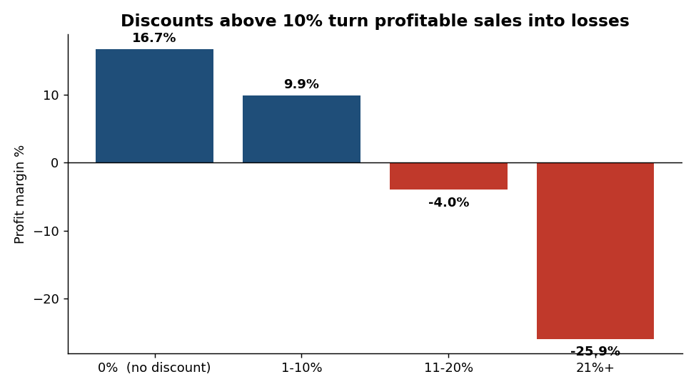
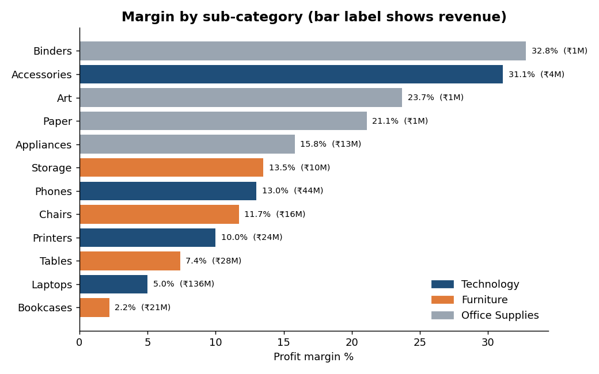
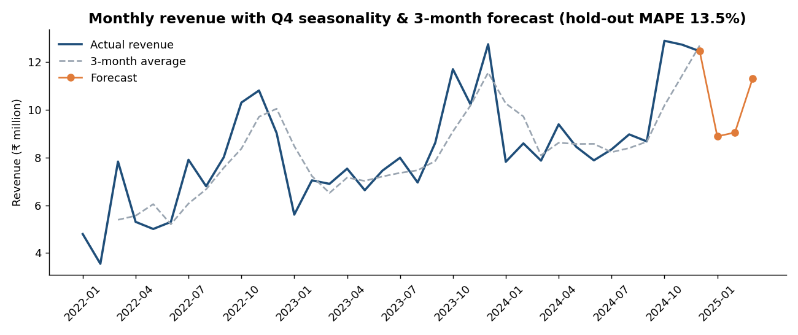

# Project 1 - Retail Sales & Profitability Analytics (SQL | Python | Excel | Power BI)

> **Business question:** Revenue is growing ~15% a year, but profit margin is only 8%. *Where is the business losing money, and what should management change?*

**Answer in one line:** discounts above 10% turn profitable sales into losses (-4% margin at 11-20% off, -26% above 20%). Capping discounts at 10% would lift profit by up to **~59%** with no change in product mix.

> Data is **synthetic** (generated by `python/generate_data.py`, seeded for reproducibility) and deliberately contains data-quality problems so the cleaning step is real. Currency: INR.



## Tools and what each was used for
| Tool | Used for |
|---|---|
| **SQL** (SQLite; CTEs, window functions) | Schema design, data-quality audit, cleaning, 12 business queries, reporting view |
| **Python** (pandas, scipy, scikit-learn, matplotlib) | Statistical tests, forecast with hold-out validation, what-if simulation, charts |
| **Excel** | Formula-driven summary (SUMIFS), discount what-if model, conditional formatting, charts, Pivot Table guide |
| **Power BI** | 3-page dashboard (star schema, DAX, theme) - build kit in `powerbi/` |

## Workflow
```
raw CSVs (dirty) -> SQLite staging -> SQL cleaning -> star schema + vw_sales_report
      -> 12 analysis queries -> Python stats/forecast/charts -> Excel model -> Power BI dashboard
```

## Data quality issues found and fixed (`sql/02_data_cleaning.sql`)
| Issue | Rows | Fix |
|---|---|---|
| Duplicate order records | 40 | `ROW_NUMBER() OVER (PARTITION BY order_id)` keep first |
| Region typos (`west`, ` West `) | 60 | `TRIM` + case normalisation |
| NULL discount | 35 | `COALESCE(discount, 0)` - assumption documented |

After cleaning: 9,000 orders, 16,758 line items, 1,498 purchasing customers, 60 products, Jan 2022 - Dec 2024.

## Key findings
| # | Finding | Evidence |
|---|---|---|
| 1 | Growth is healthy | Revenue ₹84.6M (2022) -> ₹99.3M (+17.4%) -> ₹114.0M (+14.7%); Q4 = 35% of annual revenue |
| 2 | **Discounts above 10% destroy profit** | Margin: no discount 16.7%, 1-10% 9.9%, 11-20% **-4.0%**, 21%+ **-25.9%**. 15.9% of line items lose money and 99% of those carry >10% discount. Spearman correlation discount vs margin = -0.67 |
| 3 | Biggest category is the thinnest | Laptops = 46% of revenue at only 5.0% margin; Bookcases 2.2%. Office Supplies earn 17.3% margin but are just 5% of revenue |
| 4 | Revenue is concentrated geographically | Mumbai = 24% of revenue; Jaipur is the smallest market |
| 5 | A large win-back opportunity exists | RFM: 272 "At Risk" customers hold ₹68.3M of historical revenue; top 20% of customers = 43% of revenue (broad-based, not a strict 80/20) |
| 6 | Forecast | Seasonal-trend model, hold-out MAPE 13.5%; Q1-2025 forecast ≈ ₹29.2M |




## Recommendations
1. **Cap standard discounts at 10%** and require manager approval above it. Upper-bound impact: profit ₹24.7M -> ₹39.1M (assumes no volume loss, so real impact is lower - validate with an A/B test in one city).
2. **Re-price or bundle laptops and bookcases** (high revenue, low margin); push accessories (31% margin) as add-ons.
3. **Win-back campaign for the 272 At-Risk customers**; protect "Champions" with early access rather than discounts.
4. **Stock and staff for Q4** (35% of revenue) and use the forecast for Jan-Mar planning.

## SQL techniques demonstrated
CTEs - window functions (`LAG`, `RANK`, `NTILE`, running `SUM() OVER`) - conditional aggregation - de-duplication with `ROW_NUMBER` - cohort retention - RFM scoring - Pareto/cumulative share - views - constraints and indexes. Written for SQLite; for MySQL replace `strftime('%Y-%m', d)` with `DATE_FORMAT(d,'%Y-%m')` and `julianday` differences with `DATEDIFF`; PostgreSQL uses `TO_CHAR` and date subtraction.

## Repository structure
```
project-1-retail-sales-analytics/
|-- data/raw/               dirty source CSVs (customers, products, orders, order_items)
|-- data/processed/         query results (q01..q12), forecast, insights.txt   (regenerated)
|-- sql/                    01_schema.sql, 02_data_cleaning.sql, 03_business_analysis.sql
|-- python/                 generate_data.py, run_pipeline.py, analysis.py, build_excel.py
|-- excel/                  Retail_Sales_Analysis.xlsx (formulas, what-if, charts)
|-- powerbi/                data/ (star schema CSVs), dax_measures.md, theme.json, DASHBOARD_BUILD_GUIDE.md
`-- images/                 charts used in this README
```

## How to reproduce
```bash
pip install -r ../requirements.txt
python python/generate_data.py     # optional - raw CSVs are already included
python python/run_pipeline.py      # SQL: load -> clean -> analyse -> export
python python/analysis.py          # stats, forecast, charts
python python/build_excel.py       # rebuild the Excel model
```
Then open `powerbi/DASHBOARD_BUILD_GUIDE.md`.

## Limitations and next steps
- Synthetic data: patterns are realistic but not real market evidence. Swap in the public "Superstore" dataset to re-run on real data.
- Profit excludes shipping, returns and tax. The discount what-if ignores price elasticity.
- Next: price-elasticity estimate, customer lifetime value, market-basket analysis.
