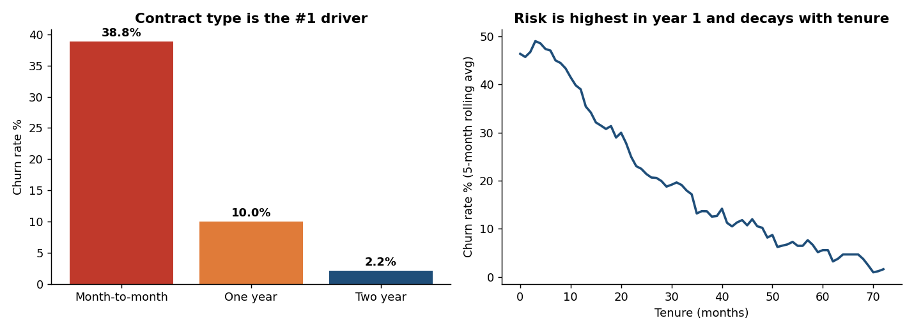
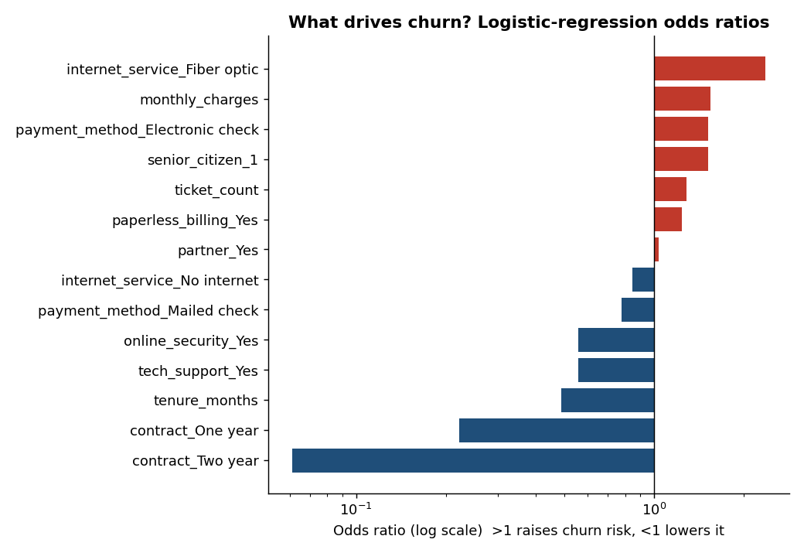
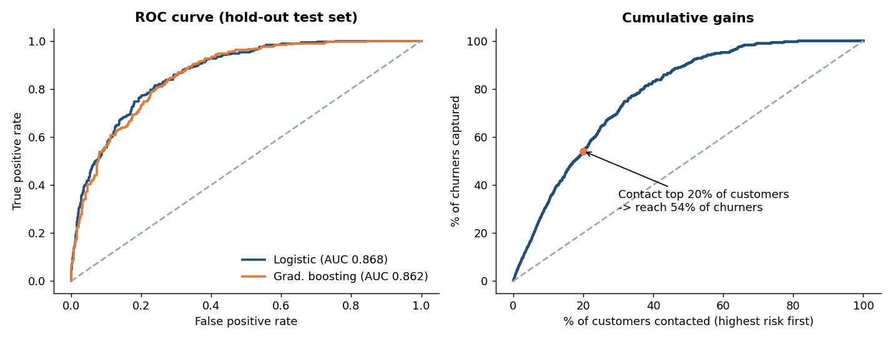

# Project 2 - Telecom Customer Churn: Drivers, Prediction & Retention ROI (SQL | Python | Excel | Power BI)

> **Business question:** 24% of customers leave and take **$116.5K of monthly revenue** with them. *Who leaves, why, and is a retention campaign worth the money?*

**Answer in one line:** churn is concentrated in month-to-month fiber customers in their first year (**70% churn**). A logistic-regression model (ROC-AUC **0.87**) captures **54% of churners by contacting just 20% of customers**, and a targeted offer breaks even at only an **8.7% save rate**.

> Data is **synthetic** (generated by `python/generate_data.py`, seeded). It mimics a real telecom customer table, so conclusions demonstrate method - not real-world market facts.



## Tools and what each was used for
| Tool | Used for |
|---|---|
| **SQL** (SQLite) | Cleaning, customer-360 view with joins, 11 churn queries (segments, tenure survival view, rule-based risk flag) |
| **Python** (pandas, scipy, scikit-learn) | Hypothesis tests with effect sizes, logistic regression + gradient-boosting benchmark, cross-validation, out-of-fold scoring, risk tiers |
| **Excel** | Live churn tables (COUNTIFS), **retention ROI scenario model** with blue/yellow input cells, sensitivity table, break-even |
| **Power BI** | 3-page dashboard: overview, decomposition tree / key influencers, action list with What-if parameters |

## Workflow
```
raw CSVs -> SQLite staging -> clean (dedupe, fix blanks) -> vw_customer_360 -> SQL segment analysis
   -> Python tests + model -> churn_scores.csv (out-of-fold) -> Excel ROI model + Power BI action dashboard
```

## Data quality fixes (`sql/02_data_cleaning.sql`)
25 duplicate customer rows removed (`ROW_NUMBER`) - 16 blank `total_charges` for brand-new customers set to 0 - `Yes/No` churn converted to a 1/0 flag - orphan-ticket check (0 found).

## Key findings
| # | Finding | Evidence |
|---|---|---|
| 1 | **Contract is the #1 driver** | Churn: month-to-month 38.8%, one-year 10.0%, two-year 2.2% (18x gap) |
| 2 | **Year one is the danger zone** | Customers with 0-12 months tenure = 46% of all churn; churn falls from 44.9% (0-12m) to 3.8% (49m+) |
| 3 | **Fiber + no tech support is the worst product profile** | Fiber churn 41.6% without tech support vs 30.4% with it; DSL ~15-18% either way |
| 4 | Payment friction | Electronic-check payers churn 28.8% vs 20.5% for mailed check |
| 5 | Service issues predict churn | 0 tickets 17.0% churn -> 3+ tickets 38.1%; churned customers rated support 2.66/5 vs 3.54 for retained |
| 6 | Demographics don't matter | Gender, partner, dependents not significant at 5% (chi-square) |
| 7 | A simple rule already works | Month-to-month + fiber + <=12 months + no tech support = 437 customers, **74.8% churn** |



## Model
| Item | Result |
|---|---|
| Primary model | Logistic regression (interpretable odds ratios) |
| Test ROC-AUC | **0.868** (5-fold CV on training data 0.864) |
| Benchmark | Gradient boosting 0.862 - no meaningful gain, so the interpretable model wins |
| Operating point (F1-optimal on training CV) | threshold 0.31: precision 0.56, recall 0.75 |
| Lift | Contacting top 20% riskiest customers captures **54%** of churners (**2.7x** lift) |
| Risk tiers (out-of-fold) | High tier actual churn 65% - Medium 29% - Low 5% |

**Leakage and rigour choices:** `total_charges` dropped (= monthly x tenure); post-ticket satisfaction excluded (only exists after a bad experience); threshold chosen on training folds only; every customer's score is out-of-fold. Probability quality: Brier score 0.121 vs 0.183 for a no-skill model (`data/processed/model_metrics.json`).



## Retention campaign ROI (Excel: `Retention_ROI` sheet)
Assumptions (yellow cells, all editable): 25% save rate, 15% discount for 6 months, 30% offer take-up, $5 contact cost, saved customers stay 12 more months, 50% margin.

| Scenario | Contacted | Net benefit | ROI |
|---|---|---|---|
| A - High tier only | 417 | **$22.9K** | **189%** |
| B - High + Medium | 1,687 | **$24.2K** (highest) | 58% |
| C - Everyone | 4,551 | -$31.2K | -31% |

Takeaway: target selectively - the extra Medium-tier spend adds little profit and dilutes ROI; contacting everyone destroys value. Break-even save rate for Scenario A is 8.7%; the campaign loses money below ~9%.

## Recommendations
1. Offer **12-month contract incentives** to month-to-month customers in their first 90 days (largest, cheapest lever).
2. Bundle **tech support free for 3 months** with new fiber contracts (-11 pts churn) and fix fiber outage tickets.
3. Nudge electronic-check users to auto-pay with a one-time credit.
4. Give the retention team the weekly **High-tier active-customer list** (417 customers, $37K monthly revenue) from the Power BI action page.

## Repository structure
```
project-2-telecom-churn-analytics/
|-- data/raw/          customers.csv, support_tickets.csv (dirty)
|-- data/processed/    SQL results, customer_360, churn_scores, stat_tests, odds_ratios, model_metrics.json
|-- sql/               01_schema.sql, 02_data_cleaning.sql, 03_churn_analysis.sql
|-- python/            generate_data.py, run_pipeline.py, analysis.py, build_excel.py
|-- excel/             Churn_Retention_Model.xlsx
|-- powerbi/           data/, dax_measures.md, theme.json, DASHBOARD_BUILD_GUIDE.md
`-- images/            charts
```

## How to reproduce
```bash
pip install -r ../requirements.txt
python python/generate_data.py   # optional - raw CSVs already included
python python/run_pipeline.py
python python/analysis.py
python python/build_excel.py
```

## Limitations and next steps
- Synthetic data; real data would need more feature engineering (usage, complaints text, competitor offers).
- Labels are a snapshot (churned vs active), not a time-based design; production use needs a prediction window (e.g. features at month t, churn in t+1..t+3).
- Association is not causation: only an A/B test of the offer proves uplift. ROI inputs are assumptions.
- Next: survival analysis (Kaplan-Meier / Cox), uplift modelling, SHAP explanations. (An R version of the tests is a good extension.)
